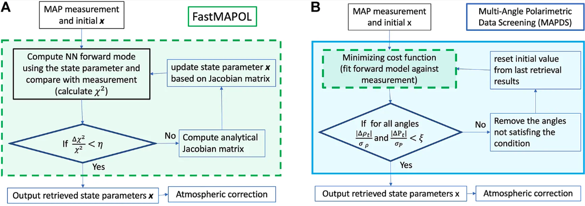

# Retrieval Algorithm: Adaptive Multi-angle Data Screening {#sec-data-screening}

**Implementation status**

| Model | DITL | PACE V3 | PACE V4 | Evaluation | Planned |
| --- |:---:|:---:|:---:|:---:|:---:|
| - | x | x | x | — | — |

FastMAPOL implements an adaptive multi-angle data screening approach to identify and remove individual observations that cannot be adequately represented by the forward model, while retaining valid measurements from the same pixel. This approach is particularly useful for multi-angle polarimetric observations, where clouds, sunglint, surface heterogeneity, or other scene-dependent effects may affect only a subset of viewing angles. The overall retrieval and screening workflow is illustrated in @fig-flowchart-screening, with additional details and applications provided in @Gao:2021bb.

{#fig-flowchart-screening width=80%}

## Screening Criteria

After each converged FastMAPOL retrieval, the residuals between the measurements and forward-model predictions are evaluated for each viewing angle. For reflectance and DoLP, the screening criteria are

$$
\frac{|\Delta\rho_t|}{\sigma_\rho} < \xi,
\qquad
\frac{|\Delta P_t|}{\sigma_P} < \xi,
$$ {#eq-data-screening}

where $\Delta\rho_t$ and $\Delta P_t$ are the differences between the measurements and forward-model predictions, $\sigma_\rho$ and $\sigma_P$ are the corresponding uncertainties defined in the retrieval cost function, and $\xi$ is the screening threshold.

If either reflectance or DoLP fails the screening criterion, the corresponding viewing angle is excluded from the cost function and the retrieval is repeated using the remaining observations. Additional screening criteria may also be applied for specific datasets or retrieval configurations.

## Adaptive Screening and Iterative Retrieval

The screening is adaptive because the residuals depend on the retrieved state for each pixel. After each retrieval pass, all remaining viewing angles are reevaluated using the updated forward-model fit. Measurements that fail the criteria are excluded, and a new retrieval is performed.

As illustrated in panel B of @fig-flowchart-screening, the screening and retrieval cycle is repeated until the remaining observations satisfy the screening criteria or the maximum number of screening passes is reached. The solution from the previous retrieval is used as the initial state for the next pass, reducing the additional computational cost.

A threshold of $\xi=3$ is typically used in FastMAPOL. In practice, up to three screening passes are generally sufficient to remove problematic viewing angles [@Gao:2021bb]. Because each subsequent retrieval starts from the previous solution, the total computational cost is typically less than three times that of a single retrieval.

In panel A of @fig-flowchart-screening, $\Delta\chi^2$ represents the change in the cost function used to evaluate retrieval convergence. Panel B shows the outer MAPDS loop, in which the converged retrieval is evaluated using $\Delta\rho_t$ and $\Delta P_t$ before potentially initiating another retrieval pass.